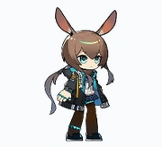
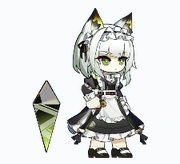
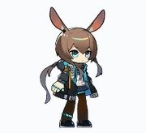
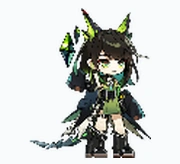
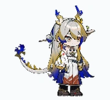
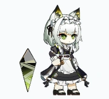

# Arknights Codex Pets

Convert Arknights Spine character assets from `Ark-Models` into animated Codex custom pets.

<p align="center">
  
  
  
  
  
</p>

<p align="center">
  <strong>Ark-Models Spine assets</strong> -> <strong>PixiJS capture</strong> -> <strong>Codex custom pet atlas</strong>
</p>

## Demo Pets

These animated WebP previews were generated with this converter and installed as Codex custom pets. GIF fallbacks are kept under `docs/assets/pets/` for clients that need them.

| Pet | Idle | Interaction |
| --- | --- | --- |
| Amiya |  |  |
| Monstr |  |  |
| Oblvns Ave Mujica |  |  |
| Shu |  |  |
| Kal'tsit Sale |  |  |

## What It Does

The tool loads an Ark-Models character directory containing:

```text
*.skel
*.atlas
*.png
```

It renders the Spine animation in Chrome through PixiJS v7 + pixi-spine v4, samples frames into the Codex pet atlas layout, writes `pet.json` and `spritesheet.webp`, and can install the result into `~/.codex/pets/<id>/`.

## Repositories

Converter repository:

```bash
git clone https://github.com/psy-shawn/Arknights-codex-pets.git
cd Arknights-codex-pets
```

Source model repository:

```bash
git clone https://github.com/isHarryh/Ark-Models.git
```

More setup detail is in [docs/DEPLOYMENT.md](docs/DEPLOYMENT.md).

## Requirements

- Windows, macOS, or another system with Chrome/Chromium available
- Node.js 20+
- Ark-Models checkout, either full or sparse

## Quick Start

```bash
git clone https://github.com/psy-shawn/Arknights-codex-pets.git
cd Arknights-codex-pets
npm install
```

Then fetch only the model directory you want from Ark-Models:

```bash
git clone --filter=blob:none --sparse https://github.com/isHarryh/Ark-Models.git Ark-Models
cd Ark-Models
git sparse-checkout set models/002_amiya
cd ..
```

Export and install the pet.

Windows:

```powershell
node bin/arkpets-codex.cjs export .\Ark-Models\models\002_amiya `
  --id amiya `
  --display-name "Amiya" `
  --chrome "C:\Program Files\Google\Chrome\Application\chrome.exe" `
  --install
```

macOS:

```bash
node bin/arkpets-codex.cjs export ./Ark-Models/models/002_amiya \
  --id amiya \
  --display-name "Amiya" \
  --chrome "/Applications/Google Chrome.app/Contents/MacOS/Google Chrome" \
  --install
```

Restart Codex, then choose `Amiya` from custom pets.

## Browser Setup

The converter needs a browser to render Spine animations. You can use either Playwright's bundled Chromium:

```bash
npx playwright install chromium
```

Or system Google Chrome.

Windows:

```powershell
node bin/arkpets-codex.cjs export .\Ark-Models\models\002_amiya `
  --id amiya `
  --display-name "Amiya" `
  --chrome "C:\Program Files\Google\Chrome\Application\chrome.exe" `
  --install
```

macOS:

```bash
node bin/arkpets-codex.cjs export /path/to/Ark-Models/models/002_amiya \
  --id amiya \
  --display-name "Amiya" \
  --chrome "/Applications/Google Chrome.app/Contents/MacOS/Google Chrome" \
  --install
```

Common Windows browser paths:

```text
C:\Program Files\Google\Chrome\Application\chrome.exe
C:\Program Files (x86)\Google\Chrome\Application\chrome.exe
C:\Program Files\Microsoft\Edge\Application\msedge.exe
C:\Program Files (x86)\Microsoft\Edge\Application\msedge.exe
```

Edge can also be passed with `--chrome` because the option accepts any Chromium-compatible executable.

## Downloading Specific Models

Ark-Models is large, so sparse checkout is the easiest way to download only the character you want:

```bash
git clone --filter=blob:none --sparse https://github.com/isHarryh/Ark-Models.git Ark-Models
cd Ark-Models
git sparse-checkout set models/002_amiya
```

To switch or add another model later, run `git sparse-checkout set` with the desired model paths:

```bash
git sparse-checkout set models/002_amiya "models/003_kalts_sale#14"
```

Quote paths that contain `#` in PowerShell, bash, or zsh.

## Usage

```bash
node bin/arkpets-codex.cjs export <model-dir> \
  --id <pet-id> \
  --display-name "<Pet Name>" \
  --out dist/<pet-id> \
  --install
```

Example:

```bash
node bin/arkpets-codex.cjs export /Users/psy/workspace/code/Ark-Models/models/003_kalts_sale#14 \
  --id kaltsit-sale \
  --display-name "Kal'tsit Sale" \
  --chrome "/Applications/Google Chrome.app/Contents/MacOS/Google Chrome" \
  --install
```

Windows example:

```powershell
node bin/arkpets-codex.cjs export ".\Ark-Models\models\003_kalts_sale#14" `
  --id kaltsit-sale `
  --display-name "Kal'tsit Sale" `
  --chrome "C:\Program Files\Google\Chrome\Application\chrome.exe" `
  --install
```

Output:

```text
dist/<pet-id>/
├── contact-sheet.png
├── mapping.json
├── pet.json
├── spritesheet.png
└── spritesheet.webp
```

When `--install` is provided, the CLI also copies `pet.json` and `spritesheet.webp` to:

```text
~/.codex/pets/<pet-id>/
```

Restart Codex, then select the pet from custom pets.

## Animation Mapping

Codex pets use a fixed `8 x 9` atlas:

- `1536 x 1872`
- `192 x 208` per cell
- 9 state rows: `idle`, `running-right`, `running-left`, `waving`, `jumping`, `failed`, `waiting`, `running`, `review`

Ark-Models characters often expose these Spine animations:

```text
Default, Interact, Move, Relax, Sit, Sleep, Special
```

The default mapping is:

| Codex state | Preferred Spine animation |
| --- | --- |
| `idle` | `Relax`, `Idle`, `Default` |
| `running-right` | `Move`, `Run`, `Walk` |
| `running-left` | mirrored `Move`, `Run`, `Walk` |
| `waving` | `Interact`, `Attack`, `Skill`, `Touch` |
| `jumping` | `Jump`, otherwise `Move` |
| `failed` | `Sleep`, `Die`, `Fail`, `Down` |
| `waiting` | `Sit`, `Wait`, `Relax` |
| `running` | `Default`, `Interact`, `Relax` |
| `review` | `Sit`, `Relax`, `Idle` |

The selected mapping is written to `mapping.json` for review.

All rows are rendered with the `idle` row's fit as the shared size basis. This keeps the pet visually consistent when Codex switches states, especially when `Interact` has wider gestures or effects than `Relax`; large non-idle poses may crop slightly instead of shrinking the whole character.

## Why This Exists

Ark-Models filenames often contain `#`, and `.atlas` files reference those PNG names directly. Browsers treat `#` as a URL fragment, so this tool copies the model files to safe temporary names:

```text
model.skel
model.atlas
model.png
```

It also explicitly loads the pixi-spine 3.8 runtime (`PIXI.spine38.Spine`) because Ark-Models `.skel` files commonly report Spine `3.8.99`.

## Notes

- The Codex pet format only supports 4-8 frames per row, so output animation is intentionally low-frame-count.
- The tool samples existing Spine animations; it does not create new in-between frames or invent missing actions.
- `contact-sheet.png` is the fastest way to check whether a model rendered correctly before installing.

## Codex Skill

This repository includes a companion skill at:

```text
skills/arkpets-codex/SKILL.md
```

The skill is useful for local Codex automation: it tells Codex how to find this repository, check dependencies, export one or more Ark-Models directories, inspect contact sheets, and install the finished pets.

Install it by copying or symlinking the skill folder into your Codex skills directory:

```bash
mkdir -p ~/.codex/skills
cp -R skills/arkpets-codex ~/.codex/skills/arkpets-codex
```

Restart Codex after installing a new skill.
